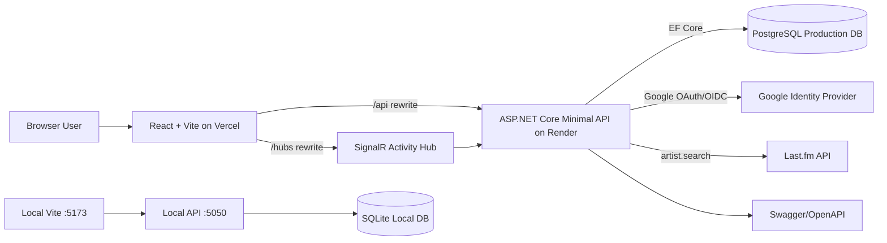
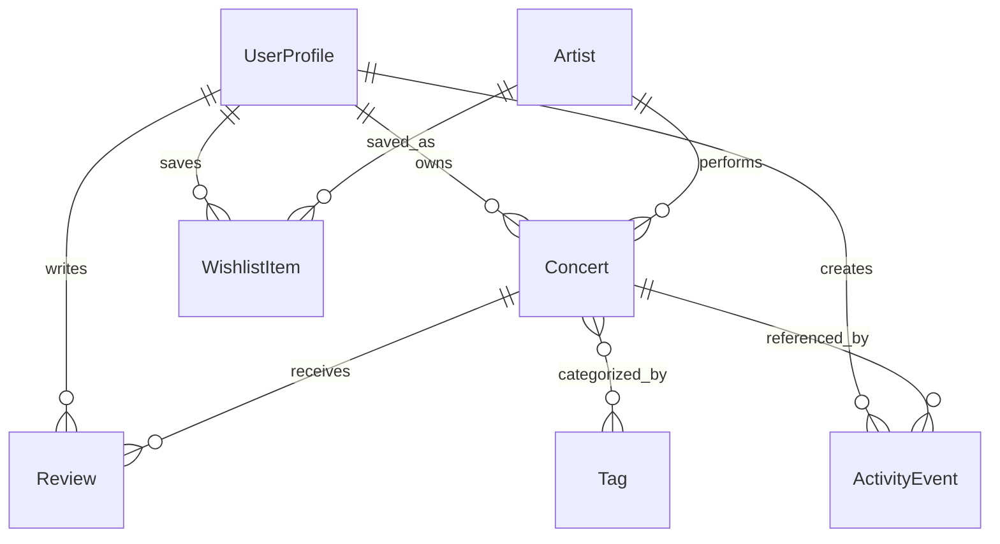

# Architecture

## System Diagram

## Key Technology Choices

- React + Vite + JavaScript: fast frontend setup with simple routing and builds.
- React Router: public and protected route structure.
- ASP.NET Core Minimal API on .NET 10: compact backend endpoints with Swagger/OpenAPI support.
- EF Core: durable persistence, migrations, relationships, and provider switching.
- SQLite locally and PostgreSQL in production: easy local setup with production-grade hosted database support.
- Google OAuth/OIDC with cookie auth: external identity provider plus server-side session management.
- Last.fm: public artist search that supports music discovery without exposing the API key to the frontend.
- SignalR: real-time public activity feed across browser sessions.
- Vercel + Render: static frontend hosting plus containerized backend hosting.

## Frontend Route Map

| Path | Component | Access | Purpose |
| --- | --- | --- | --- |
| `/` | `LandingPage` | Public | Intro and primary app entry. |
| `/about` | `AboutPage` | Public | Product/domain summary. |
| `/stats` | `StatsPage` | Public | Community database counts. |
| `/artists` | `ArtistsPage` | Public | Artists from Setlist Social database. |
| `/activity` | `ActivityPage` | Public | Public activity list plus SignalR live status. |
| `/discover` | `DiscoverPage` | Public | Last.fm artist search; signed-in users can save artists. |
| `/dashboard` | `DashboardPage` | Protected | Current user's profile and counts. |
| `/profile` | `ProfilePage` | Protected | Current user's profile summary. |
| `/my-concerts` | `MyConcertsPage` | Protected | Current user's concert CRUD flow. |
| `/wishlist` | `WishlistPage` | Protected | Current user's saved wishlist artists. |
| `/settings` | `SettingsPage` | Protected | Account/session settings area. |

## Backend Endpoint Table

| Method | Path | Access | Description |
| --- | --- | --- | --- |
| `GET` | `/api/health` | Public | Health check. |
| `GET` | `/swagger` | Public | Swagger UI in current configuration. |
| `GET` | `/api/auth/login` | Public | Starts Google OAuth challenge. |
| `GET` | `/api/auth/google-callback` | Public callback | Google middleware callback path. |
| `GET` | `/api/auth/callback` | Protected by auth result | Creates/updates local user and redirects frontend. |
| `POST` | `/api/auth/logout` | Public/session-aware | Clears app auth cookie. |
| `GET` | `/api/me` | Protected | Current signed-in profile or `401`. |
| `GET` | `/api/me/dashboard` | Protected | Current user's dashboard counts. |
| `GET` | `/api/me/concerts` | Protected | Current user's concerts. |
| `GET` | `/api/me/concerts/{id}` | Protected | Current user's concert, `403` for another user's record. |
| `POST` | `/api/me/concerts` | Protected | Create current user's concert. |
| `PUT` | `/api/me/concerts/{id}` | Protected | Update current user's concert, `403` across users. |
| `DELETE` | `/api/me/concerts/{id}` | Protected | Delete current user's concert, `403` across users. |
| `GET` | `/api/me/wishlist` | Protected | Current user's wishlist. |
| `POST` | `/api/me/wishlist` | Protected | Save artist to current user's wishlist. |
| `DELETE` | `/api/me/wishlist/{id}` | Protected | Delete current user's wishlist item, `403` across users. |
| `GET` | `/api/public/stats` | Public | Database counts. |
| `GET` | `/api/public/artists` | Public | Artist list and summary counts. |
| `GET` | `/api/public/activity` | Public | Recent public-safe activity. |
| `GET` | `/api/external/lastfm/search?artist=` | Public | Backend proxy to Last.fm artist search. |
| `POST` | `/api/dev/seed` | Development only | Small local seed. |
| `POST` | `/api/dev/seed/full?reset=true` | Development only | Full-scale deterministic seed/reset. |
| `POST` | `/api/dev/auth/test-login` | Development/test only | E2E test auth when explicitly enabled. |
| SignalR | `/hubs/activity` | Public | Live public activity updates. |

## Data Model Summary

Entities include `UserProfile`, `Artist`, `Concert`, `Review`, `WishlistItem`, `ActivityEvent`, and `Tag`. Timestamp fields are maintained through EF Core save hooks. `UserProfile.OAuthSubject` links a local profile to the authenticated Google subject but is not exposed in normal API responses.

## Deployment Architecture

The frontend is deployed to Vercel at `https://setlist-social.vercel.app`. Vercel rewrites `/api/*` and `/hubs/*` to the Render backend at `https://setlist-social.onrender.com`, keeping the browser-facing origin consistent for auth/session behavior. The backend is deployed with `backend/Dockerfile` on Render and reads Render's `PORT` variable at startup. Production data lives in PostgreSQL through `ConnectionStrings__DefaultConnection`.

Production migrations are EF Core migrations. They can be applied by setting `Database__RunMigrationsOnStartup=true` for a deployment cycle. Production-safe simulated seeding can be opted into with `Seed__RunOnStartup=true`, runs after migrations, skips existing generated/domain data, and does not drop or reset production data.

## Request Flow

1. The browser loads React from Vercel.
2. React calls same-origin `/api/*`; Vercel rewrites to Render.
3. Render validates auth cookies for protected `/api/me/*` endpoints.
4. Render reads/writes data through EF Core and PostgreSQL.
5. Render calls Last.fm from the server for public artist search.
6. Render broadcasts safe activity DTOs through SignalR.
7. React receives live updates on `/activity` without a page refresh.
